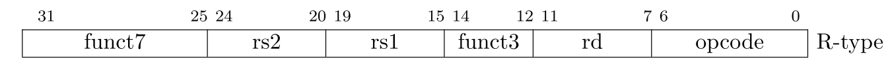
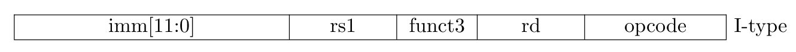
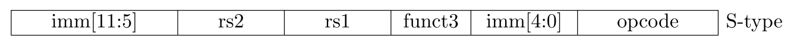
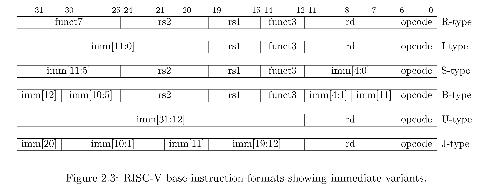

# SUPPORTED INSTRUCTIONS

## OPCODES
|name|value|value(hex)|
|--- | --- | ---|
| *OPCODE_LUI*        |011 0111|  0x37|
| *OPCODE_AUIPC*      |001 0111|  0x17|
| *OPCODE_JAL*        |110 1111|  0x6F|
| *OPCODE_JALR*       |110 0111|  0x67|
| *OPCODE_BRANCH*     |110 0011|  0x63|
| *OPCODE_LOAD*       |000 0011|  0x03|
| *OPCODE_STORE*      |010 0011|  0x23|
| *OPCODE_OP_IMM*     |001 0011|  0x13|
| *OPCODE_OP*         |011 0011|  0x33|
| *OPCODE_MISC_MEM*   |000 1111|  0x0F|
| *OPCODE_SYSTEM*     |111 0011|  0x73|

## FORMATS
### R-type

### I-type

### S-type

### U-type

### Extended notation

## INSTRUCTIONS
|name|format|opcode|
|--- | --- | ---|
|*LUI*    |U-type |OPCODE_LUI     |
|*AUIPC*  |U-type |OPCODE_AUIPC   |
|*JAL*    |J-type |OPCODE_JAL     |
|*JALR*   |I-type |OPCODE_JALR    |
|*BEQ*    |B-type |OPCODE_BRANCH  | 
|*BNE*    |B-type |OPCODE_BRANCH  |
|*BLT*    |B-type |OPCODE_BRANCH  |
|*BGE*    |B-type |OPCODE_BRANCH  |
|*BLTU*   |B-type |OPCODE_BRANCH  |
|*BGEU*   |B-type |OPCODE_BRANCH  |
|*LB*     |I-type |OPCODE_LOAD    | 
|*LH*     |I-type |OPCODE_LOAD    | 
|*LW*     |I-type |OPCODE_LOAD    | 
|*LBU*    |I-type |OPCODE_LOAD    | 
|*LHU*    |I-type |OPCODE_LOAD    | 
|*SB*     |S-type |OPCODE_STORE   |
|*SH*     |S-type |OPCODE_STORE   |
|*SW*     |S-type |OPCODE_STORE   |
|*ADDI*   |I-type |OPCODE_OP_IMM  |
|*SLTI*   |I-type |OPCODE_OP_IMM  |
|*SLTU*   |I-type |OPCODE_OP_IMM  |
|*XORI*   |I-type |OPCODE_OP_IMM  |
|*ORI*    |I-type |OPCODE_OP_IMM  |
|*ANDI*   |I-type |OPCODE_OP_IMM  |
|*SLLI*   |I-type*|OPCODE_OP_IMM  |
|*SRLI*   |I-type*|OPCODE_OP_IMM  |
|*SRAI*   |I-type*|OPCODE_OP_IMM  |
|*ADD*    |R-type |OPCODE_OP      |
|*SUB*    |R-type |OPCODE_OP      |
|*SLL*    |R-type |OPCODE_OP      |
|*SLT*    |R-type |OPCODE_OP      |
|*SLTU*   |R-type |OPCODE_OP      |
|*XOR*    |R-type |OPCODE_OP      |
|*SRL*    |R-type |OPCODE_OP      |
|*SRA*    |R-type |OPCODE_OP      |
|*OR*     |R-type |OPCODE_OP      |
|*AND*    |R-type |OPCODE_OP      |
|*FENCE*  |J-type |OPCODE_MISC_MEM|
|*FENCE.I*|J-type |OPCODE_MISC_MEM|
|*ECALL*  |I-type*|OPCODE_SYSTEM  |
|*EBREAK* |I-type*|OPCODE_SYSTEM  |
|*CSRRW*  |I-type*|OPCODE_SYSTEM  |
|*CSRRS*  |I-type*|OPCODE_SYSTEM  |
|*CSRRC*  |I-type*|OPCODE_SYSTEM  |
|*CSRRWI* |I-type*|OPCODE_SYSTEM  |
|*CSRRSI* |I-type*|OPCODE_SYSTEM  |
|*CSRRCI* |I-type*|OPCODE_SYSTEM  |
